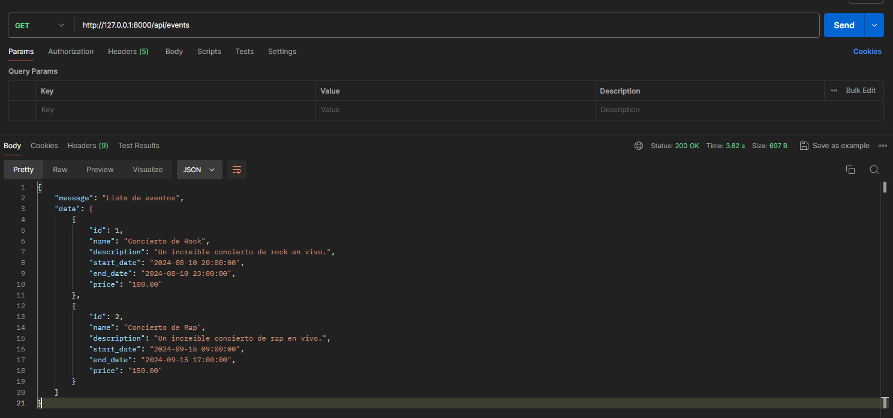
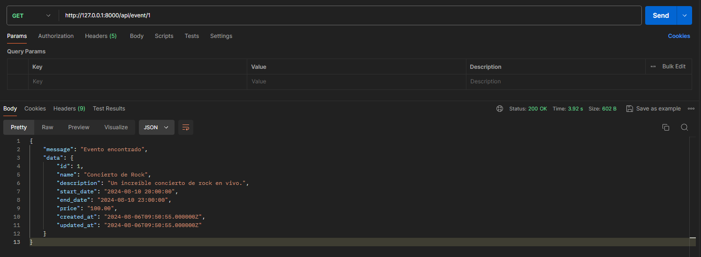
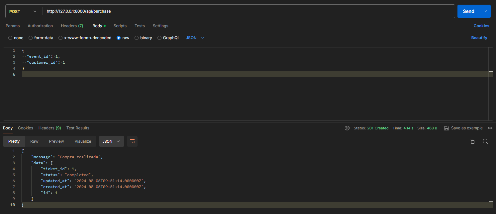
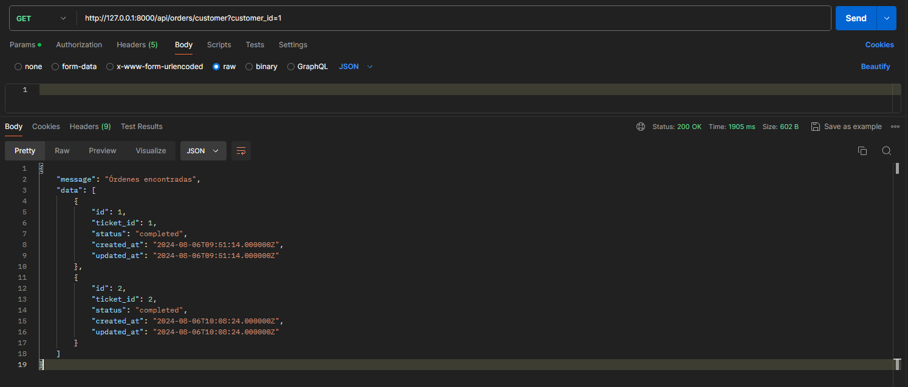

<!DOCTYPE html>
<html lang="en">
<head>
    <meta charset="UTF-8">
    <meta name="viewport" content="width=device-width, initial-scale=1.0">
</head>
<body>
<h1>Gestión de Tickets</h1>

Este proyecto utiliza Laravel y MySQL junto con Docker y Docker-compose para su ejecución. A continuación se detallan los pasos necesarios para configurar y ejecutar el proyecto.

<h2>Requisitos del Entorno</h2>
<ul>
<li>PHP 8.3.10 (cli) (built: Jul 30 2024 15:15:59) (ZTS Visual C++ 2019 x64)</li>
<li>Composer version 2.7.7 2024-06-10 22:11:12</li>
</ul>

<h2>Requisitos Previos</h2>
<ul>
<li><a href="https://www.docker.com/products/docker-desktop">Docker</a> instalado</li>
<li><a href="https://docs.docker.com/compose/install/">Docker-compose</a> instalado</li>
</ul>

<h2>Instalación</h2>
<ol>
<li>Clonar el repositorio del proyecto:</li>
<pre><code>git clone https://github.com/christianLizama/servicio-gestion-tickets.git</code></pre>

<li>Navegar al directorio del proyecto:</li>
<pre><code>cd servicio-gestion-tickets</code></pre>

<li>Copiar el archivo <code>.env.example</code> a <code>.env</code>:</li>
<pre><code>cp .env.example .env</code></pre>

<li>Construir y levantar los contenedores de Docker:</li>
<pre><code>docker-compose up --build -d </code></pre>
</ol>

<h2>Configuración Adicional</h2>

Una vez que los contenedores estén en funcionamiento, es necesario ingresar al contenedor de la aplicación y ejecutar las migraciones y los seeders.

<ol>
<li>Ingresar al contenedor de la aplicación:</li>
<pre><code>docker-compose exec app bash</code></pre>

<li>Generar la clave de la aplicación:</li>
<pre><code>php artisan key:generate</code></pre>

<li>Ejecutar las migraciones:</li>
<pre><code>php artisan migrate</code></pre>

<li>Ejecutar los seeders:</li>
<pre><code>php artisan db:seed --class=CustomerSeeder</code></pre>
<pre><code>php artisan db:seed --class=EventSeeder</code></pre>
</ol>

<h2>Uso</h2>

Una vez completados los pasos anteriores, el proyecto estará disponible en <a href="http://localhost:8000">http://localhost:8000</a>.

<h2>Consultando la API</h2>

El proyecto expone varias rutas de API que pueden ser utilizadas para interactuar con la aplicación. A continuación se muestran ejemplos de cómo consultar la API:

<h3>Obtener todos los eventos</h3>

Ruta: <code>GET /events</code>

<h3>Obtener detalles de un evento</h3>

Ruta: <code>GET /event/{id}</code>

<h3>Realizar una compra</h3>

Ruta: <code>POST /purchase</code>

<h3>Obtener órdenes por cliente</h3>

Ruta: <code>GET /orders/customer</code>

<h2>Comandos Útiles</h2>
<ul>
<li>Ver los logs de los contenedores:</li>
<pre><code>docker-compose logs</code></pre>

<li>Detener los contenedores:</li>
<pre><code>docker-compose down</code></pre>

<li>Reiniciar los contenedores:</li>
<pre><code>docker-compose restart</code></pre>
</ul>

<h2>Ejecutar sin usar Docker</h2>

Si prefieres ejecutar el proyecto sin usar Docker, sigue estos pasos:

<ol>
<li>Asegúrate de tener PHP y Composer instalados en tu máquina.</li>

<li>Instalar las dependencias del proyecto:</li>
<pre><code>composer install</code></pre>

<li>Copiar el archivo <code>.env.example</code> a <code>.env</code> y configurar las variables de entorno necesarias.</li>

<li>Generar la clave de la aplicación:</li>
<pre><code>php artisan key:generate</code></pre>

<li>Ejecutar las migraciones:</li>
<pre><code>php artisan migrate</code></pre>

<li>Ejecutar los seeders:</li>
<pre><code>php artisan db:seed --class=CustomerSeeder</code></pre>
<pre><code>php artisan db:seed --class=EventSeeder</code></pre>

<li>Levantar el servidor de desarrollo de Laravel:</li>
<pre><code>php artisan serve</code></pre>
</ol>

El proyecto estará disponible en <a href="http://localhost:8000">http://localhost:8000</a>.

<h2>Suposiciones del Proyecto</h2>
<ul>
<li>Cada cliente tiene un correo electrónico único que actúa como su identificador principal.</li>
<li>Los eventos tienen un nombre, una descripción opcional, una fecha de inicio y una fecha de finalización.</li>
<li>El precio de los eventos es un valor decimal con hasta 8 dígitos antes del punto decimal y 2 dígitos después.</li>
<li>Cada ticket está asociado con un evento específico y un cliente específico. Los tickets se eliminan automáticamente si se elimina el evento o el cliente asociado.</li>
<li>Cada orden está vinculada a un ticket específico. Las órdenes tienen un campo de estado para rastrear su progreso. Por defecto, todas las compras se consideran exitosas y se les asigna el estado de "completed". Sin embargo, es fácil editar el código para manejar otros estados en caso de errores u otras situaciones como compras por tarjeta de crédito por ejemplo. Las órdenes se eliminan automáticamente si se elimina el ticket asociado.</li>
<li>Las tablas <code>tickets</code> y <code>orders</code> tienen relaciones de clave foránea con las tablas <code>events</code>, <code>customers</code>, y <code>tickets</code> respectivamente. Se utiliza eliminación en cascada para mantener la integridad referencial.</li>
<li>Todas las tablas incluyen campos de timestamps (<code>created_at</code> y <code>updated_at</code>) para rastrear cuándo se crean y actualizan los registros.</li>
<li>No se ha implementado un sistema de inicio de sesión ni funcionalidades relacionadas, ya que el enfoque principal del proyecto es la lógica de la compra de tickets.</li>
<li>Se asume que un usuario puede comprar varios tickets para el mismo evento.</li>
<li>Para simplificar la ejecución de la solución, se han creado seeders para poblar la base de datos con datos mínimos necesarios para utilizar la aplicación. No se ha creado un sistema de inicio de sesión ni funcionalidades relacionadas, ya que se considera innecesario para los objetivos del proyecto.</li>
</ul>

</body>
</html>
